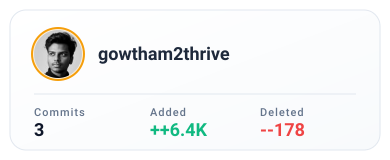
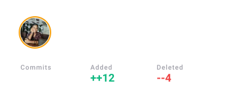
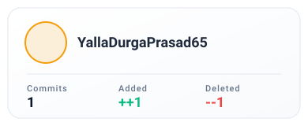

<br/>
<div align="center">
  <a href="#">
    
  </a>

  <h1 align="center">H I V E</h1>

  <p align="center">
    <strong>Discover, manage, download, and chat with GGUF models with unparalleled elegance.</strong>
    <br/>
    <i>A beautiful, robust desktop-class web application for Hugging Face.</i>
  </p>

  <p align="center">
    <a href="#"></a>
    <a href="#"></a>
    <a href="#"></a>
    <a href="LICENSE"></a>
  </p>

  <br />
  <a href="#">
    
  </a>
</div>

---

## <a href="#"></a> Features

- <a href="#"></a> **Discover Workspace**: Quickly search Hugging Face for GGUF models directly within the application.
- <a href="#"></a> **Downloads Workspace**: Manage your active downloads and view locally downloaded models in a beautiful grid layout.
- <a href="#"></a> **Chat Workspace**: Seamlessly converse with your locally downloaded GGUF models using a beautiful, built-in chat interface with Markdown support.
- <a href="#"></a> **Local Inference**: Run AI models completely locally with complete privacy, leveraging `llama-cpp-python`.
- <a href="#"></a> **Robust Downloading**: Reliable downloading mechanism that uses chunks and supports pausing, resuming, and safe cancellation.
- <a href="#"></a> **Native OS Integration**: Instantly open the containing folder of any downloaded model in your native file explorer (Windows).
- <a href="#"></a> **Beautiful Glassmorphism UI**: A dark-mode, minimalist interface designed for speed, aesthetics, and premium user experience.

---

## <a href="#"></a> Getting Started

### Prerequisites

- **Python 3.8+** installed on your system.
- Git (optional, for cloning).

### Installation

1. **Clone the repository:**

   ```cmd
   git clone https://github.com/gowtham2thrive/Hive.git
   cd hive
   ```

2. **Run the start script (Windows):**

   ```cmd
   start.bat
   ```

   *This script will automatically:*
   - Set up a Python virtual environment (`venv`).
   - Install the required dependencies (`FastAPI`, `llama-cpp-python`, `aiosqlite`, `huggingface_hub`, etc.).
   - Start the backend server on port `8080`.
   - Open the app in your default web browser.

---

## <a href="#"></a> Technologies Used

The application is built using a modern yet lightweight tech stack:

- **Frontend**: Vanilla HTML, CSS, JavaScript (No frameworks!) with [Feather Icons](https://feathericons.com/).
- **Backend**: [Python](https://www.python.org/), [FastAPI](https://fastapi.tiangolo.com/), [Uvicorn](https://www.uvicorn.org/), [llama-cpp-python](https://github.com/abetlen/llama-cpp-python), [SQLite](https://www.sqlite.org/).

---

## <a href="#"></a> Chat Feature

Hive Chat lets you have conversations with your locally downloaded GGUF models — entirely on your machine, with zero data leaving your device.

### How It Works

1. **Navigate** to the Chat tab from the sidebar
2. **Open Settings** (<a href="#"></a>) → Select your `.gguf` model from the dropdown → Click **Load Model**
3. **Start chatting** — responses stream in real-time with full markdown rendering

### Architecture

| Component | Technology | Purpose |
| --- | --- | --- |
| **Inference Engine** | `llama-cpp-python` | Loads and runs GGUF models locally with CPU auto-tuning |
| **Streaming** | WebSocket | Real-time token-by-token response streaming with micro-batching |
| **Persistence** | SQLite (async, WAL) | Stores conversations and messages across sessions |
| **Markdown** | Custom renderer | Syntax highlighting, code blocks, tables, copy-to-clipboard |
| **API** | FastAPI REST + WS | Conversation CRUD, model management, streaming chat |

### Key Capabilities

- **Real-time streaming** — Tokens stream as they're generated with adaptive render intervals
- **Conversation management** — Create, rename, search, and delete conversations
- **Model management** — Load/unload models, browse for `.gguf` files via native OS file picker
- **Markdown rendering** — Code blocks with syntax highlighting (Python, JS, CSS, etc.), tables, lists, blockquotes
- **Context truncation** — Automatically trims old messages to fit the model's context window
- **Cancel generation** — Stop responses mid-stream with visual feedback
- **Creativity slider** — Adjustable temperature from Precise (0.0) to Creative (2.0) with dynamic labels
- **Auto-scroll** — Smart scrolling that pauses when you scroll up to read
- **Inactivity watchdog** — Auto-resets if no tokens arrive for 20 seconds

---

## <a href="#"></a> Contributing

<div align="center">
  <!-- CONTRIBUTORS_START -->
<a href="https://github.com/gowtham2thrive"></a><a href="https://github.com/preethi-beri"></a><a href="https://github.com/YallaDurgaPrasad65"></a>

<!-- CONTRIBUTORS_END -->
</div>
<br/>

## <a href="#"></a> License

This project is licensed under the MIT License. See the `LICENSE` file for more details.

---
